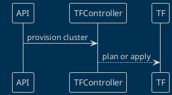
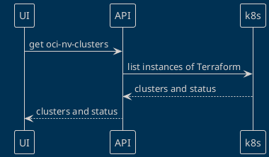
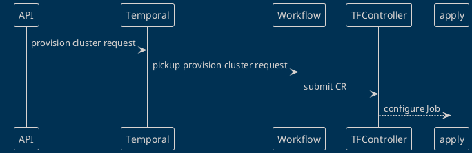

# UCL Backend Architecture for OCI

The purpose of the page is to clarify the design and components used to provision
Kubernetes (k8s) clusters within Oracle Cloud Infrastructure (OCI)

## Product Architecture

To better understand the backend architecture it is helpful to recall the large
components of the entire system.  The following diagram describes the components
within the system at a high level with basic interactions.

```plantuml
@startuml System Architecture
'ref http://plantuml.com/stdlib
!include <office/Users/user.puml>
!include <office/Users/mobile_user.puml>
!include https://raw.githubusercontent.com/plantuml-stdlib/C4-PlantUML/master/C4_Container.puml
LAYOUT_WITH_LEGEND()

Person(customer, "Customer")
Enterprise_Boundary(c1, "NGC"){
   Container(ui, "UCL UI", "Javascript, Typescript", "Allow customers to provision OCI infrastructure")
   Container(api, "UCL API", "go", "Establishes and implements the UCL API contract for both human and machine clients.")
   Container(be, "UCL Backend", "Terraform, TF-Controller", "Defines k8s custom resource to run Terraform manifests.")
}
System_Ext(oci, "Oracle Cloud")
Rel_R(customer, ui, "Uses", "https")
Rel_R(ui, api, "Calls", "https")
Rel_R(api, be, "Calls", "k8s/https")
Rel(be, oci, "Provision infrastructure", "oci/https")
@enduml
```

The diagram is a classic layered architecture with `UCL API` acting as middleware
that mediates requests from customers.

----
The remainder of this document will focus on the `UCL Backend` container.

## High Level Design

The high level design is based on a combination of Terraform (tf) and k8s
components.  

* TF modules are produced by Oracle and are the recommended method to provision
k8s clusters within their infrastructure.
  * This solution will utilize the Oracle Kubernetes Engine (oke) to utilize
  the features that come with the managed service beyond provisioning machines
  and joining them together to form a k8s cluster.
* TF-Controller to run _plan_ and _apply_ operations.

The `UCL API` is the primary client of `UCL Backend`.



The following diagram demonstrates the location of the TF module(s) and the
interactions of components with the backend system.

```plantuml
@startuml
!include https://raw.githubusercontent.com/plantuml-stdlib/C4-PlantUML/master/C4_Container.puml
System_Boundary(c0, "Workload k8s cluster"){
  System(api, "UCL API")
  System_Boundary(c1, "UCL Backend"){
   Container(tfc, "tf-controller", "Open source k8s operator for Terraform", "Execute Terraform manifests in Kubernetes")
  }
}
System_Boundary(c2, "Git Repository"){
  Container(tf, "Terraform Module", "A collection of Terraform manifests", "Module available to tf-controller")
}
Person(oci_dev, "OCI Engineering")
System_Ext(oci, "Oracle Cloud")
Rel_D(api,c1, "Calls<kube api>")
Rel_L(tf, tfc, "Obtains TF Modules")
Rel_D(tfc,oci, "Provision infrastructure")
Rel_R(oci_dev,tf, "Maintains module")
Rel_L(oci_dev,oci, "Operates infrastructure")
SHOW_LEGEND()
@enduml
```

The architecture lends itself to layered testing.  By this we mean that TF plans
can be tested atomically by running `terraform`.  The custom resource defined
by TF-Controller is called `Terraform`.  Instances of this resource can be
provisioned and tested atomically as well.  

The architecture is a good division of labor.  NV will consume TF modules produced
by Oracle.  This will enable us to focus on our value-add to the UCL product.

### Inventory

The tf-controller will keep track of cluster inventory.
It defines a custom resource (`Terraform`) that can be queried by client
applications (UI, API, any kube client).



### Deprovision

Similar to the order of operations for provisioning k8s clusters, deprovisioning
will have the same k8s flow.  The Terraform CR created by clients will
need to be configured to delete the cluster when the Terraform resource
is deleted.  It can be configured such that deletion of the CR will not remove
the underlying infrastructure that was provisioned when the CR was created.  We
do not desire to do this.

### Client Provisioning Detail

A client application request should take the following form. The parameters are
defined in an [adjacent document](../DEVELOPMENT.md).

1. Validate requested input values.
1. Map request input values to Terraform CR.
1. Fill in OCI values from CloudTrust (tenancy, etc...)
1. Apply CR.

## Next Steps

The initial MVP release will combine minimal functionality while meeting time to
market criterial.  These are the next steps in no particular order.

* Business logic integration via Temporal
* Enhanced metrics beyond those needed to operate the application.
* Technology evaluation

## Business Logic Integration

Temporal is a workflow engine that enables developers to combine activities into
atomic operations.  In our case, Temporal will allow the integration of
business logic to the core functionality of cluster provisioning.  Sending an
email when the cluster build is complete is a great example of such business
logic.  Temporal will change the architecture because it will sit between client
applications and the backend k8s controller.



## Enhanced Metrics

Other examples of business logic could include cluster lifetime statistics.
While this data can be computed (the hard way) through k8s, our workflow
implementation can add create/delete (among other milestone dates) to the
database.  This information can be published to DataDog.

## Technology Evaluation

Once the MVP is released and customers (both internal and external) we will have
a good idea about the strengths and weaknesses of our design and implementation.
While new features and CSP ports must move forward, we want to constantly evaluate
our use of technology and product direction.  

A specific evaluation we want to make is the use of Terraform.  TF was chosen
to meet time-to-market requirements but might not be the long term technical
solution.
